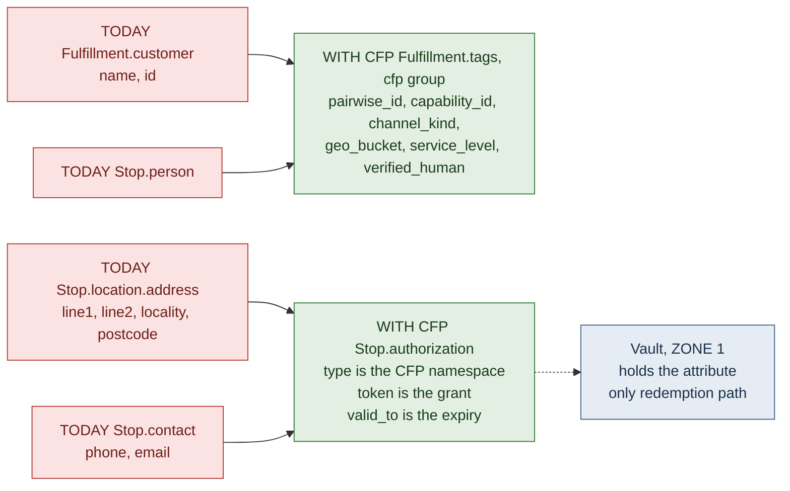
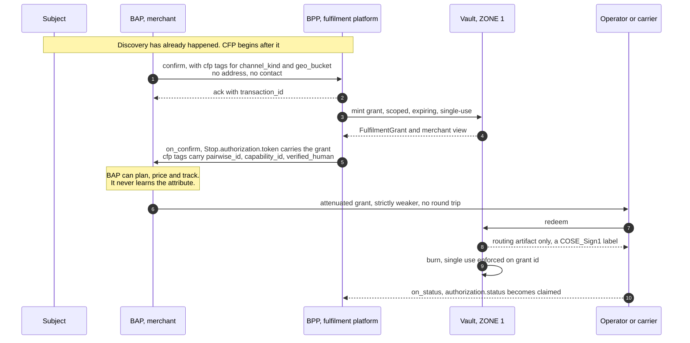
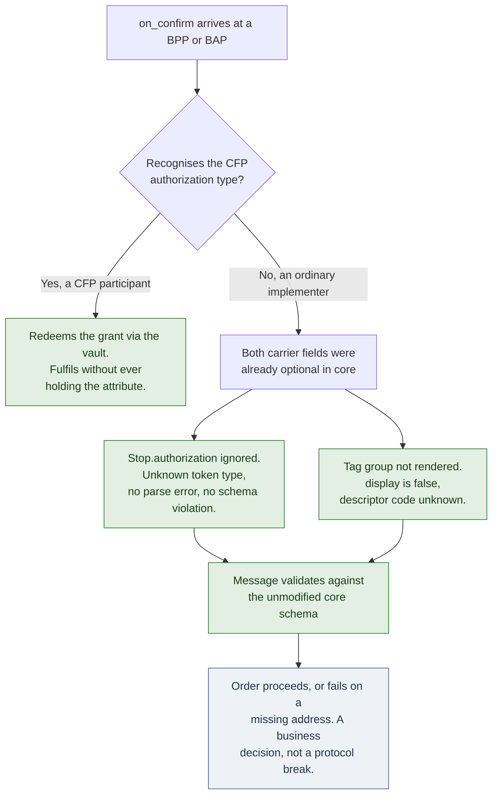

# CFP ⇄ Beckn message binding

**Status:** draft, for discussion with FIDE / the Beckn Core Working Group.
Submitted nowhere. No issue or PR has been raised upstream.

**Claim this document exists to prove:** a CFP grant can travel inside
ordinary Beckn messages using fields that already exist in `master`, with no
change to the core specification, no new schema, and no migration for any
implementer who does not opt in.

The rest of this file is the evidence for that claim, the exact field
mapping, and the parts that are still open.

---

## 1. Summary for a reviewer in a hurry

| Question | Answer |
| --- | --- |
| Does this require a change to Beckn core schemas? | **No.** |
| Does it add a field to any existing schema? | No. It populates existing optional fields. |
| Does it change any enum with a fixed allowed-value list? | No. The one vocabulary it extends, `Stop.authorization.type`, is explicitly network-policy-defined by the spec's own wording. |
| What happens to a BPP that doesn't implement CFP? | Nothing. It sees an authorization token type it doesn't recognise and a tag group it doesn't render. Both are ignorable by construction. |
| What is actually being asked of the CWG? | A namespace allocation and registration of one `proposed`-stage feature. Not a core merge. |
| Migration burden on existing networks | None. See §7. |

---

## 2. What CFP is, in one paragraph

CFP replaces *shipping a sensitive attribute* with *shipping a capability*. A
merchant never receives the customer's address or phone number. It receives a
scoped, expiring, single-use, revocable, non-widening grant that authorises a
named fulfiller to cause one action against that attribute — where the
attribute itself is held by a vault and never crosses the network. The grant
core carries no address vocabulary at all; address is its first profile,
contact/phone its second.

In Beckn terms: the thing that today sits in `Stop.location.address` is
replaced by a token in `Stop.authorization`, and the customer identity that
today sits in `Fulfillment.customer` is replaced by a pairwise identifier
that is stable per counterparty and unlinkable across counterparties.

---

## 3. The namespace

Per `CONTRIBUTION.md`, features are introduced as namespaced properties of
the form `./{namespace-id}.{feature-name}.{feature-stage}`.

Proposed:

```
./cfp.confidential-fulfilment.proposed
```

- **namespace-id:** `cfp`
- **feature-name:** `confidential-fulfilment`
- **feature-stage:** `proposed` — entering at the first stage of the
  Proposed → Draft → Recommended → Required lifecycle, targeting a **minor**
  draft branch (additive, backward-compatible), never a major one.

Every CFP-defined value in the sections below is prefixed with this
namespace. That prefix is what makes the binding self-identifying and safely
ignorable: a participant that doesn't know the namespace doesn't know the
value, and the fields carrying it are already optional.

---

## 4. Where the grant rides

### 4.1 The carrier field: `Stop.authorization`

Beckn's `Stop` schema already carries an `authorization` object, described in
the spec as a token-based authorization mechanism where *"the allowed values
for this field can be published as part of the network policy."* Its shape:

| `Authorization` field | Spec description | CFP use |
| --- | --- | --- |
| `type` | Type of authorization mechanism; allowed values published as network policy | `./cfp.confidential-fulfilment.proposed` |
| `token` | Token used for authorization, typically generated at the BPP | base64url of the canonical serialised `FulfilmentGrant` |
| `valid_from` | RFC3339 timestamp | grant issuance time |
| `valid_to` | RFC3339 timestamp | `caveats.expiresAt` |
| `status` | Current state of the token | `unclaimed` → `claimed` (mirrors single-use burn) |

This is the single most important fact in this document. **CFP does not need
a new field, because Beckn already has a field for "an opaque, typed,
time-bounded token that authorises something at a stop," and its type
vocabulary is explicitly delegated to network policy.** The extension point
was designed for exactly this class of thing.

### 4.2 The metadata: `Fulfillment.tags`

Everything the counterparty legitimately needs to *plan* fulfilment — but
which is not the grant itself — rides in one namespaced `TagGroup` under
`Fulfillment.tags`. `TagGroup` is a `{descriptor, list, display}` structure
and `Tag` is `{descriptor, value, display}`; all CFP tags are emitted with
`display: false`, because none of them are meant for a customer-facing
render.

| Tag `descriptor.code` | Value | Why the counterparty needs it |
| --- | --- | --- |
| `pairwise_id` | Stable per counterparty, unlinkable across counterparties | To recognise a repeat customer without identifying them |
| `capability_id` | Grant id | Correlation, status, revocation lookup |
| `channel_kind` | `direct` \| `access-point` \| `locker` | Determines whether an attribute is needed at all — `access-point` is the zero-attribute path |
| `geo_bucket` | Coarse region, not a postcode | Rate-card and serviceability decisions |
| `service_level` | e.g. `standard` | Pricing |
| `verified_human` | boolean | The "worth more than attribute data" signal — a distinct, assurance-checked subject, with no attribute disclosed |
| `consent_ref` | Reference to the consent record | Audit, without exposing consent contents |

None of these are attribute-shaped. `geo_bucket` is deliberately coarser than
`area_code`.

### 4.3 What is *omitted* rather than added

This is where the privacy property actually comes from. In a CFP-bound
message the following existing fields are **left unpopulated**:

| Field normally populated | CFP | Replaced by |
| --- | --- | --- |
| `Stop.location.address` | omitted | the grant in `Stop.authorization` |
| `Stop.location.area_code` | omitted | `geo_bucket` tag (coarser) |
| `Stop.location.gps` | omitted | — |
| `Stop.contact` (phone, email) | omitted | the grant (contact profile) |
| `Stop.person` | omitted | `pairwise_id` tag |
| `Fulfillment.customer` | omitted | `pairwise_id` tag |

CFP is therefore, structurally, a *subtractive* binding wearing an additive
one. It adds one token and one tag group; it removes the entire attribute
surface. That asymmetry is the contribution.

---

## 5. Diagrams

### 5.1 Field mapping — before and after



Red is what travels today. Green is what travels under CFP. The attribute
itself stops at the vault and is never a wire field at all.

### 5.2 The message flow

The binding rides the existing `confirm` / `on_confirm` pair. No new action
is introduced. `init` / `on_init` may carry the same tag group without the
token, so a BPP can quote against `geo_bucket` and `channel_kind` before any
grant exists.



### 5.3 Why a non-participating implementer is unaffected



The bottom-right box is the honest part. A non-CFP BPP does not *crash* — it
validates fine — but it also cannot fulfil an order with no address. That is
correct and intended: CFP is opt-in on both sides, and a network decides via
policy which fulfilment types accept a grant in place of an attribute. What
matters for change management is that **no existing implementer has to
change anything to keep working exactly as they do today.**

---

## 6. Wire example

`on_confirm`, abridged to the fields that matter:

```json
{
  "context": { "domain": "retail", "action": "on_confirm", "version": "1.1.0" },
  "message": {
    "order": {
      "id": "ord-9f2c",
      "fulfillments": [
        {
          "id": "F1",
          "type": "Delivery",
          "stops": [
            {
              "type": "end",
              "authorization": {
                "type": "./cfp.confidential-fulfilment.proposed",
                "token": "eyJpZCI6IjRkO...<base64url grant>",
                "valid_from": "2026-08-14T09:12:04Z",
                "valid_to": "2026-08-28T09:12:04Z",
                "status": "unclaimed"
              }
            }
          ],
          "tags": [
            {
              "display": false,
              "descriptor": { "code": "./cfp.confidential-fulfilment.proposed" },
              "list": [
                { "display": false, "descriptor": { "code": "pairwise_id" },    "value": "pw_8a31c4..." },
                { "display": false, "descriptor": { "code": "capability_id" },  "value": "c7f1-..." },
                { "display": false, "descriptor": { "code": "channel_kind" },   "value": "direct" },
                { "display": false, "descriptor": { "code": "geo_bucket" },     "value": "IN-TN-C" },
                { "display": false, "descriptor": { "code": "service_level" },  "value": "standard" },
                { "display": false, "descriptor": { "code": "verified_human" }, "value": "true" },
                { "display": false, "descriptor": { "code": "consent_ref" },    "value": "cns_5512" }
              ]
            }
          ]
        }
      ]
    }
  }
}
```

Note what is absent: no `customer`, no `location`, no `contact`, no
`person`.

### 6.1 Token serialisation

`token` is base64url over the canonical JSON of the `FulfilmentGrant`
(`packages/capability`): `{ id, caveats, chain, mac }`, where `caveats`
carries `pairwiseId`, `purpose`, `maxUnits`, `fulfiller`, `expiresAt`,
`singleUse`, `consentRef`, `channelKind`, and `chain` is the attenuation
lineage.

**An honest limitation:** `mac` is an HMAC, so the grant is *vault-verifiable
only* — a BPP or carrier holding one cannot verify it offline; it verifies by
redeeming. The offline-verifiable artifact in this system is the COSE_Sign1
redemption label (`packages/labels`), produced at redemption, not the grant
itself. If the CWG wants offline grant verification as a condition of
adoption, that is a real design change and should be raised as one rather
than glossed. It is listed in §9.

### 6.2 Attenuation on the wire

A merchant passing work to a carrier re-emits the same `Stop.authorization`
shape with a strictly weaker token — narrower `channelKind`, sooner
`expiresAt`, or a more specific `fulfiller`. Caveats accumulate and never
relax; widening is rejected (`AttenuationWidened`). No new Beckn message is
needed to *carry* it, because it is an ordinary `Stop` on the carrier's own
fulfilment.

**But narrowing is not delegation, and the binding must not imply it is.**
In the reference implementation, redemption requires the redeeming actor to
be the party named in the grant's consent entry, so a carrier holding a
validly narrowed token cannot redeem it without a consent event of its own.
A network adopting this binding therefore needs to decide where that event
is expressed — plausibly the carrier's own `confirm` against the same
subject — and that decision is not settled here. Until it is, the honest
scope of §6.2 is: the *wire shape* for a handed-on grant is unchanged, the
*authority model* for handing one on is an open question. See §9 item 5.

---

## 7. Migration impact statement

`CONTRIBUTION.md` asks contributors to evaluate migration impact and tooling
compatibility before proposing. The assessment:

| Dimension | Impact |
| --- | --- |
| Existing message schemas | Unchanged. No field added, removed, or retyped. |
| Existing enums | Unchanged. `Stop.authorization.type` values are network-policy-defined by the spec's own wording. No other vocabulary is touched. |
| Schema validators / codegen | No regeneration required. CFP messages validate against unmodified core schemas. |
| Existing BAP/BPP implementations | No change required to keep current behaviour. |
| Registry / signing layer | None. CFP uses Beckn's published subscriber-signing envelope as-is — `keyId`, BLAKE-512 digest, the three-line signing string. |
| Version target | Minor draft branch. Never a major/breaking one. |
| Rollback | Stop emitting the tag group and the authorization type. Nothing to unwind. |

---

## 8. What is explicitly *not* being proposed

Stated plainly, because the value of this contribution rests on it:

- No change to any core schema file.
- No new action or callback pair.
- No change to `subscriber_type` (`BAP` / `BPP` / `BG`). CFP's own
  `ParticipantRole` (`merchant | operator | brand | platform | facilitator`)
  and `tier` are **local vocabularies that stay local** — carried in
  `packages/registry` alongside, never conflated with, Beckn's
  `subscriber_type`, which remains an untouched optional field.
- No change to the signing or registry specification.
- No claim on discovery. CFP begins after discovery; there is no `search`,
  catalog, or `select`-shaped code anywhere in the repository.

---

## 9. Open items for the CWG

Listed at the same prominence as the resolved ones, per this project's
convention.

1. **Offline grant verification.** As above: grants are HMAC-based and
   vault-verifiable only. Whether the network requires publicly verifiable
   grants is a CWG call with real design consequences.
2. **Where `authorization.status` transitions are asserted.** CFP burns
   single-use at the vault; reflecting that back as `on_status` is
   straightforward but the authoritative-source question is a network-policy
   matter.
3. **Offline double-redemption.** A known open problem in this
   implementation, not created by the binding but inherited by it.
4. **Carrier binding.** Also open — nothing today cryptographically binds an
   attenuated grant to a specific physical carrier operative.
5. **Forward-leg delegation.** Attenuation narrows authority but does not
   transfer it — a carrier holding a validly narrowed grant cannot redeem it
   without its own consent event. Where that event is expressed in Beckn
   terms is unsettled, and it is the one open item bearing directly on this
   binding rather than on the implementation beneath it.
6. **Vault discovery and cross-vault portability.** `fulfiller` names the
   operator; resolving that to a vault endpoint via the registry is designed
   but not implemented. Cross-vault grant portability — the
   number-portability analogue — is a v0.1 design constraint, not code.
7. **Multi-vault federation.** `Vault` is single-tenant per process today. A
   network with more than one custodian is a different threat model.
8. **Namespace-id allocation.** `cfp` is a placeholder pending CWG
   assignment.

---

## 10. Relationship to the reference implementation

This repository is offered as a reference implementation, not as a pull
request. Per `CONTRIBUTION.md` the CWG approves a proposal *before*
implementation begins; the implementation here predates any upstream
conversation and exists to de-risk the proposal, not to pre-empt it.

What the repo currently demonstrates, and what it does not:

- **Does:** Beckn's signing envelope verified against the published spec
  (`packages/registry`), the async `action`/`on_action` pattern
  (`packages/network`), the full grant lifecycle end to end, three operator
  adapters with zero core diff, and two attribute profiles (address,
  contact) over one unforked grant core.
- **Does not:** implement the binding in this document. There is no
  `Stop.authorization` emitter or `Fulfillment.tags` serialiser in the
  codebase today — this document specifies it, and building it is the
  natural next step if the direction is accepted.
- **Does not:** integrate with any live Beckn or ONDC network. The registry
  is an in-process `Map` with a locally-seeded genesis facilitator; the DeDi
  directory port is an in-memory demo backend. Both boundaries are stated in
  their module docstrings and in `spec/CFP-v0.x.md`.
- **Does not:** implement the general X25519-key-conversion case of XEdDSA.
  Ed25519 keys minted directly — the case this demo and most Beckn/ONDC
  deployments use — produce identical signatures under XEdDSA and plain
  EdDSA, and that equivalence is what the implementation relies on.
